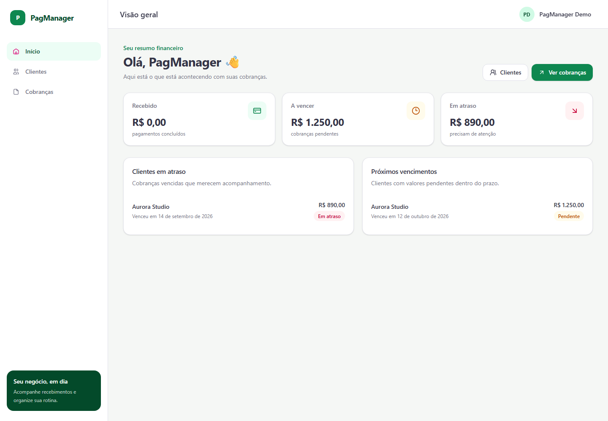
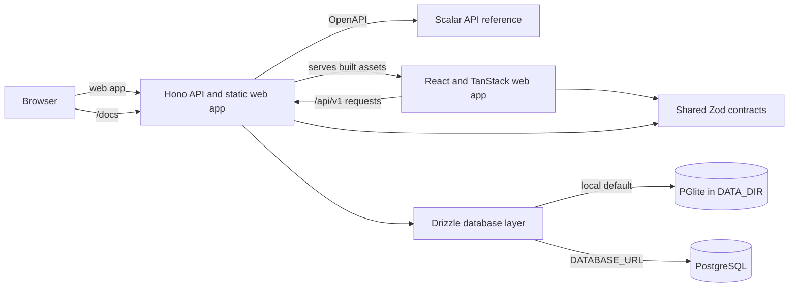

# PagManager

PagManager is a self-hosted billing management app for keeping client records, invoices, and payment status in one place. The dashboard summarizes paid, upcoming, and overdue invoices. The web app and API are served from the same application in production.



## Features

- Manage clients and their invoices.
- Track paid, upcoming, and overdue charges from the dashboard.
- Register and manage user profiles.
- Use the web app, REST API, and interactive API reference from one deployment.

## Architecture



## Technology stack

- **Web:** React 19, TypeScript, Vite, TanStack Router and Query, Tailwind CSS 4, Radix UI, and Storybook.
- **API:** Hono, TypeScript, Zod OpenAPI, and Scalar.
- **Data:** Drizzle ORM, PGlite for the local default, or PostgreSQL through `DATABASE_URL`.
- **Workspace:** pnpm with shared contracts and database packages.

## Run locally with pnpm

Use Node.js 24 (pinned in `.nvmrc`) and pnpm 10.34.6 (pinned in `package.json`). Run `nvm use` if you use nvm, then `corepack enable` to activate the pinned package manager. From the repository root:

```sh
pnpm install --frozen-lockfile
pnpm build
pnpm start
```

Open <http://localhost:5000>. Without `DATABASE_URL`, the API uses PGlite and keeps its data and generated JWT secret under `DATA_DIR` (default `./data`).

To start the API and web development servers together:

```sh
pnpm dev
```

This builds the shared contracts and database packages before starting both servers. After changing either shared package, run `pnpm build:shared` to refresh its generated files. To start the servers individually, use two terminals:

```sh
pnpm --filter @pagmanager/api dev
pnpm --filter @pagmanager/web dev
```

Vite serves the web app at <http://localhost:5173> and forwards `/api` requests to the API on port 5000. The API reference is at <http://localhost:5000/docs>; its OpenAPI document is at <http://localhost:5000/openapi.json>.

Run workspace checks from the repository root:

```sh
pnpm lint
pnpm typecheck
pnpm test
pnpm test:e2e
```

`typecheck` runs `tsc -b` using the root project references: contracts and database first, then the API and web app. The projects inherit strict settings from `tsconfig.base.json`; Node packages use NodeNext resolution and the web app uses Bundler resolution. The API's generated declarations live in `apps/api/dist-types`, separate from its runtime bundle. `test` builds shared packages and runs the four projects listed in `vitest.workspace.ts` through the root Vitest configuration. Database and API suites run in separate groups; `test:e2e` builds the application and runs Playwright separately. Database commands are available as `pnpm db:generate`, `pnpm db:migrate`, and `pnpm db:seed`.

`pnpm install` installs Lefthook in Git checkouts with development dependencies. Before each commit, hooks check staged source files with the pinned local Biome and run `tsc -b`. Run `pnpm hooks:install` to reinstall the hooks. Source archives and container builds skip hook installation; set `LEFTHOOK=0` to skip the automatic installation when needed.

## Run with Docker Compose

Copy `.env.example` to `.env`, replace the example secrets, then start the app and PostgreSQL:

```sh
cp .env.example .env
docker compose up --build -d
docker compose logs -f app
```

On PowerShell, use `Copy-Item .env.example .env` for the first command. The app is available at <http://localhost:8080> (or the `APP_PORT` configured in `.env`). Compose stores PostgreSQL and application data in named volumes. The API reference is at <http://localhost:8080/docs>.

To run only PostgreSQL in a local development environment, start the database service from `compose.dev.yaml`:

```sh
docker compose -f compose.dev.yaml up -d postgres
```

Set `DATABASE_URL` to the local PostgreSQL connection string before starting the API. To use the published image instead of building from source, set `PAGMANAGER_IMAGE=ghcr.io/mikedpsm/pagmanager:latest` in `.env`, then run `docker compose pull app` and `docker compose up -d --no-build`.

## Configuration

The application accepts these variables:

| Variable | Purpose | Default |
| --- | --- | --- |
| `NODE_ENV` | Runtime mode: `development`, `test`, or `production`. | `development` |
| `PORT` | API port. | `5000` |
| `DATABASE_URL` | PostgreSQL connection string. Leave unset to use PGlite. | unset |
| `DATA_DIR` | Persistent PGlite data and generated JWT secret location. | `./data` |
| `JWT_SECRET` | Secret used to sign authentication tokens. Required in production with PostgreSQL. | generated and persisted if unset |
| `CORS_ORIGIN` | Allowed browser origin. | `*` |
| `WEB_DIST_DIR` | Optional path to the built web app. | resolved automatically |
| `VITE_API_URL` | Optional API origin when the web app is hosted separately. | same origin |

Compose also reads `POSTGRES_DB`, `POSTGRES_USER`, `POSTGRES_PASSWORD`, `APP_PORT`, and `PAGMANAGER_IMAGE`. `compose.dev.yaml` also accepts `POSTGRES_PORT`. Keep `.env` private and replace all example secrets before deployment.

## Modernization references

The [`legacy-v1` tag](https://github.com/mikedpsm/PagManager/tree/legacy-v1) preserves the original v1 backend at commit `a401d3f`, immediately before the first modernization merge. The [`modernize` branch](https://github.com/mikedpsm/PagManager/tree/modernize) was created from `main` at commit `ad55b96` when [task T0.1 (#11)](https://github.com/mikedpsm/PagManager/issues/11) was completed.

To inspect the original package metadata from a local checkout:

```sh
git fetch origin tag legacy-v1
git show legacy-v1:package.json
```

## Authors

- **Maicon Douglas Paiva da Silva** — [LinkedIn](https://www.linkedin.com/in/mikedpsm/)
- **Jonatas Ximenez** — [LinkedIn](https://www.linkedin.com/in/devindio/)

The root package metadata retains the ISC license recorded in the repository's initial public commit.

## Português (Brasil)

PagManager é uma aplicação auto-hospedada para organizar clientes, cobranças e pagamentos. O painel resume cobranças pagas, a vencer e em atraso. Em produção, a aplicação web e a API são servidas pelo mesmo serviço.

### Executar com pnpm

Use Node.js 24 (fixado em `.nvmrc`) e pnpm 10.34.6 (fixado em `package.json`). Execute `nvm use` se você usa nvm e depois `corepack enable` para ativar o gerenciador de pacotes fixado. Na raiz do repositório:

```sh
pnpm install --frozen-lockfile
pnpm build
pnpm start
```

Acesse <http://localhost:5000>. Sem `DATABASE_URL`, a API usa PGlite e mantém os dados e o segredo JWT gerado no diretório `DATA_DIR` (por padrão, `./data`). Para iniciar a API e a aplicação web juntas durante o desenvolvimento, execute `pnpm dev`. Esse comando compila os pacotes compartilhados antes de iniciar os dois servidores; após alterar esses pacotes, execute `pnpm build:shared` para atualizar os arquivos gerados. Para desenvolver separadamente, execute `pnpm --filter @pagmanager/api dev` e `pnpm --filter @pagmanager/web dev` em terminais diferentes. O Vite usa a porta 5173 e encaminha as chamadas `/api` para a API na porta 5000.

Execute `pnpm lint`, `pnpm typecheck` e `pnpm test` na raiz para verificar o workspace. `typecheck` usa `tsc -b` e as referências entre projetos para compilar os contratos e o banco antes da API e da aplicação web. As opções strict ficam em `tsconfig.base.json`; os pacotes Node usam resolução NodeNext e o frontend usa Bundler. As declarações da API ficam em `apps/api/dist-types`, separadas do bundle de execução. `test` compila os pacotes compartilhados e executa os quatro projetos de `vitest.workspace.ts` pela configuração Vitest da raiz, com grupos separados para banco e API. `pnpm test:e2e` compila a aplicação e executa os testes Playwright separadamente. Os comandos de banco são `pnpm db:generate`, `pnpm db:migrate` e `pnpm db:seed`.

`pnpm install` instala o Lefthook em checkouts Git com dependências de desenvolvimento. Antes de cada commit, os hooks verificam os arquivos staged com o Biome local e executam `tsc -b`. Use `pnpm hooks:install` para reinstalar os hooks. Builds de contêiner e arquivos de código sem Git pulam a instalação; `LEFTHOOK=0` desativa a instalação automática quando necessário.

### Executar com Docker Compose

Copie `.env.example` para `.env`, troque as senhas de exemplo e inicie a aplicação com PostgreSQL:

```powershell
Copy-Item .env.example .env
docker compose up --build -d
docker compose logs -f app
```

Acesse <http://localhost:8080> ou a porta definida em `APP_PORT`. O Compose mantém o banco e os dados da aplicação em volumes nomeados. Para iniciar somente o PostgreSQL durante o desenvolvimento, use `docker compose -f compose.dev.yaml up -d postgres` e configure `DATABASE_URL` antes de iniciar a API.

### API e configuração

A documentação interativa da API fica em `/docs`; o documento OpenAPI fica em `/openapi.json`. A tabela de variáveis na seção [Configuration](#configuration) descreve `NODE_ENV`, `PORT`, `DATABASE_URL`, `DATA_DIR`, `JWT_SECRET`, `CORS_ORIGIN`, `WEB_DIST_DIR` e `VITE_API_URL`. O Compose também aceita `POSTGRES_DB`, `POSTGRES_USER`, `POSTGRES_PASSWORD`, `APP_PORT` e `PAGMANAGER_IMAGE`. Não publique o arquivo `.env` nem use os segredos de exemplo em produção.

### Referências da modernização

A tag [`legacy-v1`](https://github.com/mikedpsm/PagManager/tree/legacy-v1) preserva o backend original v1 no commit `a401d3f`, anterior ao primeiro merge de modernização. A branch [`modernize`](https://github.com/mikedpsm/PagManager/tree/modernize) foi criada a partir de `main` no commit `ad55b96` ao concluir a [tarefa T0.1 (#11)](https://github.com/mikedpsm/PagManager/issues/11). Os comandos da seção [Modernization references](#modernization-references) permitem consultar os metadados originais em um checkout local.

### Autores

- **Maicon Douglas Paiva da Silva** — [LinkedIn](https://www.linkedin.com/in/mikedpsm/)
- **Jonatas Ximenez** — [LinkedIn](https://www.linkedin.com/in/devindio/)
