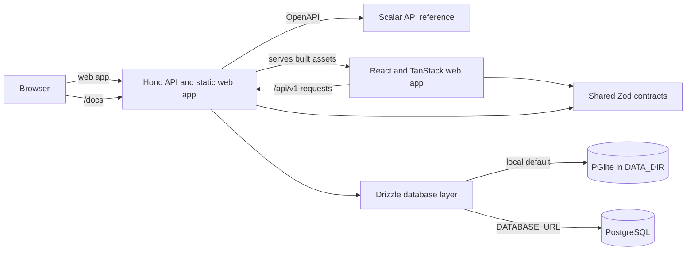

# PagManager

PagManager is an independent, self-hosted billing management product that brings clients, invoices, and payment tracking into one workspace. It helps you organize billing and see what has been paid, what is coming due, and what is overdue.

Deploy it on your own infrastructure with persistent local storage or PostgreSQL. The web app and REST API run together in a single deployment. An interactive API reference is available in development and test environments.


## Features

- **Client management:** keep client records and their invoices together.
- **Invoice tracking:** manage invoices and track their payment status.
- **Billing overview:** monitor paid, upcoming, and overdue invoices from the dashboard.
- **User accounts:** register, sign in, and manage your profile.
- **Self-hosting:** run with PGlite or PostgreSQL using pnpm or Docker Compose.
- **API access:** use the REST API alongside the web app and its interactive reference during development.

## Architecture



## Technology stack

- **Web:** React 19, TypeScript, Vite, TanStack Router and Query, Tailwind CSS 4, Radix UI, and Storybook.
- **API:** Hono, TypeScript, Zod OpenAPI, and Scalar.
- **Data:** Drizzle ORM, PGlite for the local default, or PostgreSQL through `DATABASE_URL`.
- **Workspace:** pnpm with shared contracts and database packages.

## Run locally with pnpm

Use Node.js 24 (pinned in `.nvmrc`) and pnpm 10.34.6 (pinned in `package.json`). Run `nvm use` if you use nvm, then `corepack enable` to activate the pinned package manager. From the repository root:

```sh
pnpm install --frozen-lockfile
pnpm build
pnpm start
```

Open <http://localhost:5000>. Without `DATABASE_URL`, the API uses PGlite and keeps its data and generated JWT secret under `DATA_DIR` (default `./data`).

To start the API and web development servers together:

```sh
pnpm dev
```

This builds the shared contracts and database packages before starting both servers. After changing either shared package, run `pnpm build:shared` to refresh its generated files. To start the servers individually, use two terminals:

```sh
pnpm --filter @pagmanager/api dev
pnpm --filter @pagmanager/web dev
```

Vite serves the web app at <http://localhost:5173> and forwards `/api` requests to the API on port 5000. The API reference is at <http://localhost:5000/docs>; its OpenAPI document is at <http://localhost:5000/openapi.json>.

Run workspace checks from the repository root:

```sh
pnpm lint
pnpm typecheck
pnpm test
pnpm test:e2e
```

`typecheck` runs `tsc -b` using the root project references: contracts and database first, then the API and web app. The projects inherit strict settings from `tsconfig.base.json`; Node packages use NodeNext resolution and the web app uses Bundler resolution. The API's generated declarations live in `apps/api/dist-types`, separate from its runtime bundle. `test` builds shared packages and runs the four projects listed in `vitest.workspace.ts` through the root Vitest configuration. Database and API suites run in separate groups; `test:e2e` builds the application and runs Playwright separately. Database commands are available as `pnpm db:generate`, `pnpm db:migrate`, and `pnpm db:seed`.

`pnpm install` installs Lefthook in Git checkouts with development dependencies. Before each commit, hooks check staged source files with the pinned local Biome and run `tsc -b`. Run `pnpm hooks:install` to reinstall the hooks. Source archives and container builds skip hook installation; set `LEFTHOOK=0` to skip the automatic installation when needed.

## Run with Docker Compose

Copy `.env.example` to `.env`, replace the example secrets, and set `CORS_ORIGIN` to the exact browser origin (for example `http://localhost:8080` locally or `https://pagmanager.example.com` on your server). Then start the app and PostgreSQL:

```sh
cp .env.example .env
docker compose up --build -d
docker compose logs -f app
```

On PowerShell, use `Copy-Item .env.example .env` for the first command. The app is available at <http://localhost:8080> (or the `APP_PORT` configured in `.env`). Compose stores PostgreSQL and application data in named volumes. `/docs` and `/openapi.json` return 404 in production.

To run only PostgreSQL in a local development environment, start the database service from `compose.dev.yaml`:

```sh
docker compose -f compose.dev.yaml up -d postgres
```

Set `DATABASE_URL` to the local PostgreSQL connection string before starting the API. To use the published image instead of building from source, set `PAGMANAGER_IMAGE=ghcr.io/mikedpsm/pagmanager:latest` in `.env`, then run `docker compose pull app` and `docker compose up -d --no-build`.

## Configuration

The application accepts these variables:

| Variable | Purpose | Default |
| --- | --- | --- |
| `NODE_ENV` | Runtime mode: `development`, `test`, or `production`. | `development` |
| `PORT` | API port. | `5000` |
| `DATABASE_URL` | PostgreSQL connection string. Leave unset to use PGlite. | unset |
| `DATA_DIR` | Persistent PGlite data and generated JWT secret location. | `./data` |
| `JWT_SECRET` | Secret used to sign authentication tokens. Production validates the resolved secret and requires an explicit value with PostgreSQL. | generated and persisted if unset with PGlite |
| `CORS_ORIGIN` | Exact allowed HTTP(S) browser origin. Required in production; wildcard is rejected. | `*` in development/test |
| `WEB_DIST_DIR` | Optional path to the built web app. | resolved automatically |
| `VITE_API_URL` | Optional API origin when the web app is hosted separately. | same origin |

Compose also reads `POSTGRES_DB`, `POSTGRES_USER`, `POSTGRES_PASSWORD`, `APP_PORT`, and `PAGMANAGER_IMAGE`. `compose.dev.yaml` also accepts `POSTGRES_PORT`. Keep `.env` private and replace all example secrets before deployment.

## Security configuration

Generate `JWT_SECRET` from at least 32 cryptographically random bytes, for example with `node -e "console.log(require('node:crypto').randomBytes(32).toString('hex'))"`. Production rejects short secrets, common placeholders and obvious repeated patterns. These checks cannot prove that a secret was randomly generated. Existing PGlite secrets are validated too; back up the data directory before changing its `jwt-secret` file. Rotating the secret invalidates existing tokens and requires users to sign in again.

New access tokens expire after one hour. The browser still stores them in `localStorage`, so JavaScript running on the same origin can access them. The shorter lifetime limits the exposure window; moving sessions to HttpOnly cookies remains a separate authentication change. Tokens issued before this change keep their original expiry unless the signing secret is rotated. Expired sessions are cleared when an API request returns 401. Changing a password requires the current password; changing other profile fields does not.

HTTP request bodies are limited to 100 KiB. Input names are limited to 100 characters, invoice descriptions to 500 characters, and client searches to 100 characters. Existing records remain readable. The server also sets a Content-Security-Policy on the served frontend, omits database details from public health failures and sanitizes production error logs.

The frontend CSP allows inline CSS required by Sonner notifications and Radix dialogs. Scripts remain restricted to the same origin and a response nonce, without `unsafe-inline` or `unsafe-eval`. Development API documentation has a separate policy that permits its jsDelivr scripts and inline CSS; `/docs` and `/openapi.json` return 404 in production.

Public authentication endpoints limit each connection IP to 10 login attempts per 15 minutes, 5 registrations per hour and 20 email availability checks per 15 minutes. A blocked request returns 429 with `Retry-After`. Each endpoint tracks at most 10,000 addresses per server process; if that capacity is reached, new addresses must wait for a window to expire. Client-supplied forwarding headers are not trusted. Behind a reverse proxy, clients may share the proxy's address, so also configure client-aware limits at that trusted proxy. With multiple replicas, use a shared limiter at the gateway to enforce an aggregate limit.

## Authors

- **Maicon Douglas Paiva da Silva** — [LinkedIn](https://www.linkedin.com/in/mikedpsm/)
- **Jonatas Ximenez** — [LinkedIn](https://www.linkedin.com/in/devindio/)

## License

PagManager is licensed under the ISC license.
